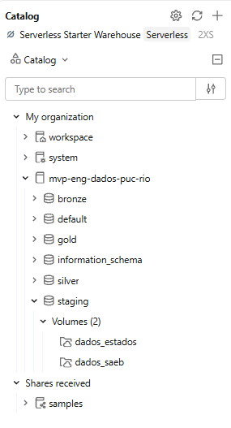
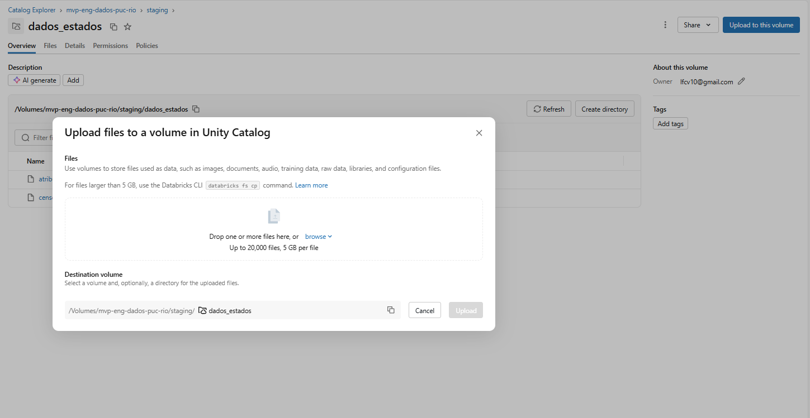
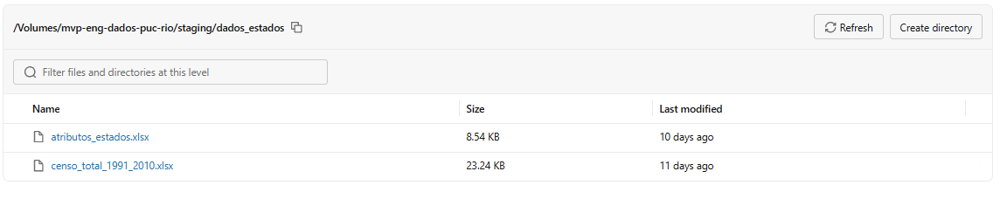
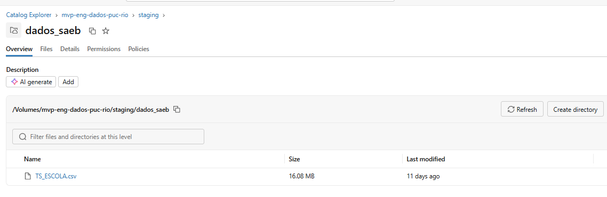
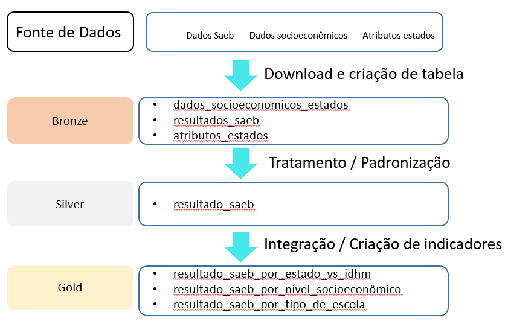
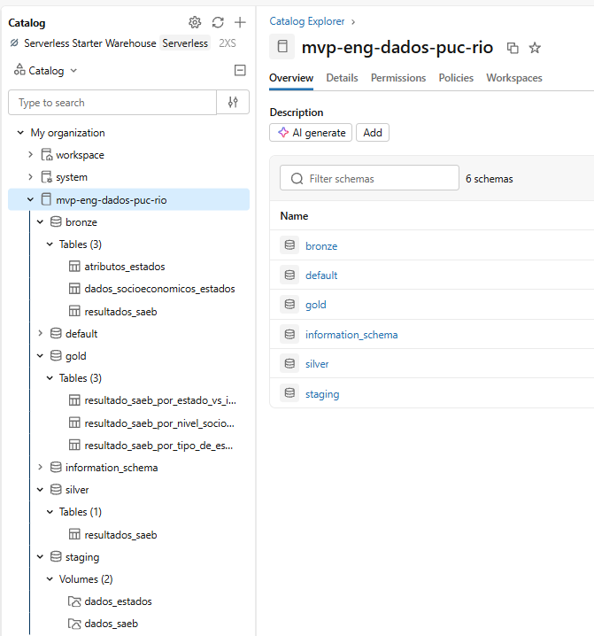

# poc-puc-mvp-eng-dados
MVP desenvolvido na disciplina de engenharia de dados na pós graduação de Ciência de Dados e Analytics na PUC-Rio

# 1. Contexto de Negócio e Perguntas

## 1.1 Contexto e Objetivo do Trabalho

A educação básica brasileira apresenta diferenças significativas de desempenho entre escolas, municípios e estados. Para compreender essas diferenças, foi desenvolvido o Saeb.

O Saeb (Sistema de Avaliação da Educação Básica) é um conjunto de avaliações externas em larga escala criado em 1990 pelo Inep para diagnosticar a qualidade da educação básica no Brasil.

**Como funciona**

Testes e questionários: O Saeb é um conjunto de testes e questionários que avaliam o desempenho dos estudantes em Língua Portuguesa e Matemática, além de coletar dados contextuais e socioeconômicos.

Periodicidade: É aplicado a cada dois anos, geralmente envolvendo a rede pública inteira e uma amostra da rede privada.

Público-alvo: Abrange estudantes de diferentes etapas do ensino, com foco tradicional no 5º e 9º ano do Ensino Fundamental e no 3º ano do Ensino Médio.

O objetivo deste trabalho será analisar os dados do Saeb por escola no ano de 2023 (último com microdados disponíveis), buscando identificar padrões de desempenho, diferenças entre redes de ensino e relações entre características das escolas e seus resultados educacionais. O foco das análises será nos dados do 9º ano do ensino fundamental com o objetivo de avaliar a qualidade do ensino básico.

Além dos dados educacionais, serão incorporados indicadores de desenvolvimento dos estados brasileiros, permitindo investigar se as diferenças observadas no desempenho escolar estão associadas ao contexto socioeconômico em que as escolas estão inseridas.

## 1.2. Perguntas a serem respondidas

1) Quais estados apresentam os melhores e piores desempenhos médios no SAEB?
2) Existem diferenças relevantes de desempenho entre escolas públicas e privadas?
3) Qual a diferença de desempenho das escolas de diferentes niveis socioeconômicos?
4) Quais estados entregam um desempenho educacional abaixo do esperado para seu nível de desenvolvimento?
5) Existem estados que se destacam por apresentar bons resultados educacionais mesmo possuindo indicadores socioeconômicos inferiores?

## 1.3. Resumo dos Dados Utilizados

Para este trabalho foram utilizadas três fontes de dados, os dados de desempenho por escola no Saeb, uma base de dados socioeconômicos dos estados e uma terceira para servir de dimensão e conectar as bases.

## 1.3.1. Dados do Saeb

Foram utilizados os resultados por escola do Saeb 2023, obtidos a partir do portal de acesso a informação do governo federal (https://www.gov.br/inep/pt-br/acesso-a-informacao/dados-abertos/microdados/saeb).

A base é um arquivo csv com o resultado escola a escola para as notas de cada escola obtidas nas disciplinas de português e matemática para o 5º e 9º ano do ensino fundamental, assim como para o ano de conclusão do ensino médio. 

Os detalhes dos dados disponíveis podem ser encontrado na etapa [3.3. Catálogo de Dados](#33-catálogo-de-dados).

## 1.3.2. Dados socioeconômicos dos estados

Foram utilizados os dados do censo demográfico de 1991 a 2010 realizado pelo IBGE, baixados a partir do site do Atlas do Desenvolvimento Humano no Brasil (https://www.atlasbrasil.org.br/acervo/biblioteca). 
Dentro dessa base há diversos indicadores socioeconômicos como IDHM,  por estado, gerados por ano de realização do censo, renda per capita, entre outros. 

Os detalhes dos dados disponíveis podem ser encontrado na etapa [3.3. Catálogo de Dados](#33-catálogo-de-dados).

## 1.3.3. Tabela dimensão de estados

Tabela gerada com os estados brasileiros + distrito federal com as regiões em que cada estado está contido. Criada para servir de tabela dimensão que conecta as outras duas bases de dados.

# 2. Carga dos dados

A carga de dados foi realizada no Databricks via carga manual. Para permitir isso foram utilizados dois notebooks:

O primeiro foi o [notebook de preparação](Workspace/01%20%20-%20preparação.ipynb). Nele, foram criados todos os schemas utilizados nesse trabalho, que são:

1) staging: schema criado para servir de repositório dos arquivos com os dados originais
2) bronze: criado com o intuito disponibilizar os dados dos arquivos contidos no schema de staging em tabelas.
3) silver: criado com o intuito de disponibilizar tabelas com dados padronizados, limpos e organizados. 
4) gold: Camada final com tabelas criadas com objetivo criar agregações e métricas para responder as perguntas

A imagem abaixo mostra as 4 camadas criadas dentro do Databricks:

O segundo notebook criado foi o [notebook de download](Workspace/02%20-%20download.ipynb). Nele, foram criados dois volumes, que são:

1) dados_saeb: volume para os dados do exame saeb (explicados na etapa [1.3.1](#131-dados-do-saeb)). Upload dos dados feito de forma manual com um arquivo csv
2) dados_estados: volume para os dados socioeconômicos dos estados e atributos(explicados na etapas [1.3.2](#132-dados-socioeconômicos-dos-estados) e [1.3.3](#133-tabela-dimensão-de-estados), respectivamente). Upload dos dados feito de forma manual com dois arquivos excel (atributos_estados.xlsx e censo_total_1991_2010.xlsx)

A imagem abaixo mostra o processo realizado:

E os resultados, com os três arquivos utilizados dentro dos volumes criados.

# 3. Modelagem e Catálogo de Dados

## 3.1. Modelo de dados

O modelo de dados utilizado foi separado em três camadas, bronze, silver e gold. Um esquema com as tabelas geradas pode ser visto abaixo, assim como uma visualização dessas tabelas dentro do Databricks. Em seguida, serão explicadas a função de cada tabela e mostrados os catálogos de dados associadas a cada uma.

Visualização no Databricks:

### 3.2.1. Camada bronze

Na camada bronze estão disponibilizadas três tabelas:

1) resultados_saeb: Dado bruto com os resultados do saeb por escola gerados a partir dos dados explicados na seção [1.3.1](#131-dados-do-saeb)

2) dados_socioeconomicos_estados: Dado bruto dos indicadores socioeconômicos dos estados gerado a partir dos dados explicados na seção [1.3.2](#132-dados-socioeconômicos-dos-estados)

3) atributos_estados: Dado bruto da tabela dimensão com os estados brasileiros gerado a partir dos dados explicados na seção  [1.3.3](#133-tabela-dimensão-de-estados)

### 3.2.2. Camada silver

Na camada silver só há uma tabela chamada resultados_saeb. Essa tabela foi criada para tratar a base resultados_saeb da camada bronze. Sua principal função é deixar a tabela mais palatável para o usuário final, com mudança de códigos númericos para valores mais facilmente entendidos pelos usuários, entre outras tratativas.

ex: para uma coluna informando se a cidade é capital ou interior ao invés de utilizar 1 para Capital e 0 para Interior já entrega ao usuário os valores Capital e Interior.

Um maior detalhamento sobre as tratativas realizadas nessa camada será dado na etapa [4. Pipeline de Dados](#4-pipeline-de-dados)

### 3.2.3. Camada gold

Na camada gold há 3 tabelas, criadas com o intuito de responder as questões apresentadas na etapa [1.2. Perguntas a serem respondidas](#12-perguntas-a-serem-respondidas). Elas são:

**1) resultado_saeb_por_estado_vs_idhm**: Tabela criada para responder as perguntas 1, 4 e 5. Esta tabela contém dados sobre os resultados do sistema educacional brasileiro, conforme avaliados pelo SAEB para o 9º ano do ensino fundamental, juntamente com o Índice de Desenvolvimento Humano Municipal (IDHM) de cada estado do Brasil. Ela reúne diversas métricas, como pontuações médias nas avaliações, classificações (rankings) com base nessas pontuações e enquadramentos por quartis.

Ela é gerada a partir da junção da tabela da camada silver resultados_saeb com a tabela de IDHM, após realizar um agrupamento por estado na tabela resultados_saeb.

**2) resultado_saeb_por_nivel_socioeconomico**: A tabela contém dados sobre o desempenho de escolas categorizadas por níveis socioeconômicos. Ela inclui métricas como o número de escolas, níveis de proficiência em língua portuguesa e matemática para estudantes do 9º ano, bem como médias de pontuação e distribuições entre diferentes categorias de proficiência. Esses dados podem ser úteis para analisar resultados educacionais relacionados ao status socioeconômico, avaliar a efetividade de políticas educacionais e identificar áreas de melhoria em grupos socioeconômicos específicos.

**3) resultado_saeb_por_tipo_de_escola**: Esta tabela contém dados sobre o desempenho escolar diferenciado por tipo de escola, especificamente pública e privada. Ela inclui o número de escolas e as pontuações médias em língua portuguesa e matemática para o 9º ano. Possíveis casos de uso incluem analisar o desempenho educacional por tipo de escola e estudar o impacto da gestão escolar nos resultados dos estudantes.

## 3.3. Catálogo de Dados

Os dados de todas tabelas foram catalogados por dentro do próprio Databricks usando a funcionalidade disponível. Para facilitar a visualização foi criado o [notebook de visualização de catalogos](Workspace/06%20-%20visualização%20catalogos.ipynb). Dentro dele há uma célula com output para cada uma das tabelas apresentadas acima, apresentando informações como tipo de dados e comentários explicando do que se trata cada coluna. Para mostrar a utilização da funcionalidade do databricks podem ser vistos dois prints, com exemplo de como ficaram as telas. Para o conjunto completo acesse o notebook.

## 3.4. Esquema

O esquema de dados pode ser visto na imagem abaixo.

A tabela bronze.atributos_estados atua como referência central para o relacionamento, usando a coluna Estado como chave primária. Ela conecta o ESTADO utilizado no SAEB aos dados socioeconômicos, que utilizam UFN como chave de relacionamento, além de servir de referência para as análises agregadas na camada Gold.

# 4. Pipeline de Dados

O pipeline de dados foi gerado com 5 notebooks diferentes, que são:

[01 - notebook de preparação](Workspace/01%20%20-%20preparação.ipynb) : Notebook criado para criar os schemas necessários, conforme explicado na sessão [2. Carga dos Dados](#2-carga-dos-dados)

[02 - notebook download](Workspace/02%20-%20download.ipynb) : Notebook criado para criar os volumes necessários, conforme explicado na sessão [2. Carga dos Dados](#2-carga-dos-dados)

[03 - notebook bronze](Workspace/03%20-%20bronze.ipynb) : Notebok criado para geração das três tabelas da camada bronze. 

[04 - notebook silver](Workspace/04%20-%20silver.ipynb) : Notebok criado para geração da tabela da camada silver. 

[05 - notebook gold](Workspace/05%20-%20gold.ipynb) : Notebok criado para geração das três tabelas da camada gold. 

## 4.1. Camada bronze

Foram inicialmente criadas as três tabelas explicadas na sessão [3.2.1. Camada bronze ](#321-camada-bronze)

Seu objetivo é basicamente ler os arquivos brutos explicados na sessão [2. Carga dos Dados](#2-carga-dos-dados) e gerar as tabelas em seu formato cru, sem trativas.

## 4.2. Camada silver

Na camada silver foi gerada a tabelas resultados_saeb. Os principais tratamentos realizados foram:

1) Criar coluna ESTADO com o nome do estado, não um código, com o objetivo de facilitar o trabalho dos usuários finais. O de para de código para o nome do estado está no comentário da coluna na camada bronze

2) Criar a coluna area, mostrando se é capital ou interior a partir da coluna ID_AREA. Sendo 1 para Capital e 2 Interior

3) criar a coluna escola_publica, informando se é publica ou privada a partir da coluna IN_PUBLICA. Sendo 0 Privada e 1 Pública

4) criar a coluna localizacao, informando se é rural ou urbana a partir da coluna ID_LOCALIZACAO. sendo 1 Urbana e 2 Rural

5) Criação de colunas de FLAG, informando se a escola participou ou não do exame naquela faixa de ensino, sendo 1 para tendo participado e 0 para não

6) Criação de colunas de proficiência por ano escolar e disciplina, com o objetivo de traduzir as pontuações dos exames, que variam de 0 a 500 e possuem faixas de desempenho específicas para cada disciplina e ano escolar, em níveis de proficiência de interpretação mais clara, conforme a regra abaixo:

As médias de proficiência das escolas são classificadas de acordo com os
padrões de desempenho definidos para cada etapa de ensino e disciplina.

A classificação é realizada separadamente para:

- **5º ano do Ensino Fundamental**
- **9º ano do Ensino Fundamental**
- **3ª série do Ensino Médio**

E para as disciplinas:

- **Língua Portuguesa (LP)**
- **Matemática (MT)**

Quando a escola não apresenta resultado para determinada etapa/disciplina,
a classificação recebe o valor **"Sem resultado"**. Dessa forma, a ausência
de uma etapa de ensino não é interpretada como baixo desempenho.

---

###  Faixas de Avaliação de Matemática

| Padrão de Desempenho | 5º ano EF | 9º ano EF | 3ª série EM |
|---|---:|---:|---:|
| **Abaixo do Básico** | Até 175 pontos | Até 225 pontos | Até 275 pontos |
| **Básico** | 176 a 225 pontos | 226 a 300 pontos | 276 a 350 pontos |
| **Adequado** | 226 a 275 pontos | 301 a 350 pontos | 351 a 400 pontos |
| **Avançado** | 276 pontos ou mais | 351 pontos ou mais | 401 pontos ou mais |

---

###  Faixas de Avaliação de Língua Portuguesa

| Padrão de Desempenho | 5º ano EF | 9º ano EF | 3ª série EM |
|---|---:|---:|---:|
| **Abaixo do Básico** | Até 150 pontos | Até 225 pontos | Até 250 pontos |
| **Básico** | 151 a 200 pontos | 226 a 275 pontos | 251 a 300 pontos |
| **Adequado** | 201 a 250 pontos | 276 a 325 pontos | 301 a 350 pontos |
| **Avançado** | 251 pontos ou mais | 326 pontos ou mais | 351 pontos ou mais |

---

7) Apagar a coluna ID_REGIAO. Ela estará numa tabela dimensão de estado, que apresentará essas informações gerais por estado

8) Apagar as colunas anteriores codificadas que não serão mais utilizadas (ID_AREA, IN_PUBLICA, ID_LOCALIZACAO, ID_REGIAO )

## 4.2.1. Qualidade dos dados

Ao longo do código há diversas checagens após realização de cada uma das atividades para checar se houveram casos que não foram pegos no tratamento realizado. Entre elas, ao gerar a coluna ESTADO a partir dos IDs dos estados foi verificado se havia algum caso não encontrado, conforme print abaixo:

## 4.3. Camada gold

O pipeline da camada gold foi separado em algumas etapas dentro do notebook. Uma primeira etapa mais geral e compartilhada por todas as três tabelas geradas será detalhada, em seguida, os tratamentos específicos de cada base. Da mesma forma que para a camada silver foram gerados ao longo do código etapas de qualidade de dados.

### 4.3.1. Filtragens compartilhadas das tabelas

Foi definido para a análise a avaliação dos dados do último SAEB para o 9º ano do ensino fundamental, para isso foram feitos os filtros:

#### 4.3.1.1. Filtragem da base silver.df_saeb

1) Filtrar a base com o objetivo de utilizar somente o último SAEB para geração das tabelas da camada gold. Na base original só há o resultado do SAEB de 2023, mas esse filtro deixará a camada gold preparada para analisar o resultado de novos SAEBs, caso seja feito o upload desses dados
2) Filtrar somente escolas que foram avaliadas no 9º ano do ensino fundamental

#### 4.3.1.2. Filtragem da base bronze.dados_socioeconomicos

Nesta base foi feito um filtro para somente pegar os indicadores do último censo do IBGE disponível.

### 4.3.2. Geração da tabela gold.resultado_saeb_por_tipo_de_escola

Para gerar essa tabela foi utilizada a tabela gerada na etapa [4.3.1.1](#4211-filtragem-da-base-silverdf_saeb). Foi realizado um agrupamento pelo tipo de escola (pública ou privada), a partir da coluna [escola_publica] e calculadas médias de português e matemática.

### 4.3.3. Geração da tabela gold.resultado_saeb_por_nivel_socioeconomico

Para responder  a pergunta "qual a diferença de desempenho das escolas de diferentes niveis socioeconômicos?" , é preciso explicar as classificações do nível socioeconômico:

- **Nível I** : O estrato mais baixo; famílias com menor escolaridade (até o fundamental incompleto) e posse restrita de bens básicos (como geladeira, TV e celular).
- **Níveis II, III e IV**: Indicam faixas de transição com aumento gradual de itens de conforto em casa e anos de estudo dos responsáveis.
- **Níveis V e VI**: Concentram a maior parte das escolas e estudantes brasileiros, com escolaridade média no ensino fundamental/médio completo e maior acesso a eletrodomésticos e tecnologia.
- **Níveis VII e VIII**: Os patamares mais elevados da escala, caracterizados por maior escolaridade parental (ensino superior) e maior infraestrutura de bens e serviços contratados no domicílio.

Para fazer essa avaliação, foram adotadas duas abordagens a serem geradas em uma tabela unificada.

1) Foi calculada a média de proficiência por nível socioeconômico para identificar diferenças de desempenho entre os grupos. Como as notas do SAEB são baseadas na TRI, também foram criadas categorias de proficiência para facilitar a interpretação dos resultados. A explicação dessas categorias está na etapa [4.2](#42-camada-silver)

2) Para aprofundar a análise, foram calculados os percentuais de escolas em cada faixa de proficiência — Abaixo do Básico, Básico, Adequado e Avançado — por nível socioeconômico. As quatro categorias totalizam 100% das escolas de cada grupo, permitindo analisar não apenas a média, mas também como as escolas se distribuem entre as diferentes faixas de desempenho. O mesmo foi realizado para matemática

### 4.3.4. Geração da tabela gold.resultado_saeb_por_estado_vs_idhm

Essa tabela foi gerada para responder as seguintes perguntas:

3) Quais estados apresentam os melhores e piores desempenhos médios no SAEB?
4) Quais estados entregam um desempenho educacional abaixo do esperado para seu nível de desenvolvimento?
5) Existem estados que se destacam por apresentar bons resultados educacionais mesmo possuindo indicadores socioeconômicos inferiores?

Para facilitar a resposta a esse tipo de perguntas é necessário gerar uma tabela unificada com os desempenhos médios por estado no SAEB com os indicadores socioeconômicos por estado. Para isso, os seguintes passos foram realizados:

1) Agrupamento dos resultados do saeb por estado, calculando a média para português e matemática

2) Realização de join com a tabela dimensão df_atributos para obter dados gerais dos estados (obs: criada etapa 4.2.1 para avaliar a qualidade desse join, verificando se houve multiplicação de linhas, por exemplo)

3) Realização de join com a tabela dimensão df_indicadores para obter os indicadores socioeconômicos dos estados (obs: criada etapa 4.3.1 para avaliar a qualidade desse join, verificando se houve multiplicação de linhas, por exemplo)

4) Para visualmente facilitar a análise foram criados dois rankings, um pelo indicador de IDHM que foi o escolhido para a análise e outro fazendo o valor médio entre as notas de português e matemática para cada estado. Com isso, a comparação passará a ser feita a partir de posição entre os estados, facilitando a visualização

5) Além disso, foi feita uma etapa para separar esses 2 rankings em quartis e criada uma métrica para avaliar se o estado está no mesmo quartil nos dois rankings ou se está em ranking diferentes, permitindo rapidamente identificar quem está acima ou abaixo do esperado, ajudando a responder as perguntas 4 e 5

Os quartis foram gerados para o ranking de notas e para o de IDHM

Para os quartis tanto de notas quanto de IDHM, quanto menor o valor, melhor o resultado, logo:

 Quartil 1 = estados com maiores médias no SAEB

 Quartil 4 = estados com menores médias no SAEB

Em seguida, foi criada a métrica CLASSIFICACAO_IDHM_SAEB que fez a seguinte categorização:

1) Caso os quartis sejam iguais: Em linha com o esperado
2) Caso o quartil de nota seja 1 acima do quartil de IDHM: Levemente acima do esperado
3) Caso o quartil de nota seja 2 acima do quartil de IDHM: Acima do esperado
4) Caso o quartil de nota seja 3 acima do quartil de IDHM: Muito acima do esperado

2) Caso o quartil de nota seja 1 abaixo do quartil de IDHM: Levemente abaixo do esperado
3) Caso o quartil de nota seja 2 abaixo do quartil de IDHM: Abaixo do esperado
4) Caso o quartil de nota seja 3 abaixo do quartil de IDHM: Muito abaixo do esperado

# 5. Análise de Dados

A etapa de análise de dados será feita explicando cada uma das perguntas em ordem.

## 5.1. Existem diferenças relevantes de desempenho entre escolas públicas e privadas?

| Escola Pública | Quantidade de Escolas | Média 9º EF - LP | Média 9º EF - MT |
|---|---:|---:|---:|
| Pública | 31.080 | 251,86 | 250,15 |

**Conclusão:** Como só há escolas públicas na base, não é possível avaliar o resultado entre públicas e privadas, entretanto, se no futuro forem adicionadas, será gerada uma tabela com essa informação

OBS: Para garantir que isso não foi um erro de dentro do [notebook silver](Workspace/04%20-%20silver.ipynb) foi verificado na etapa 1.3.1. que na base completa realmente só haviam escolas públicas, corroborando essa resposta e que não foi um erro de tratamento.
## 5.2. Qual a diferença de desempenho das escolas de diferentes niveis socioeconômicos?

A tabela com o resumo pode ser vista abaixo:

| Nível Socioeconômico | Quantidade de Escolas | Proficiência 9º EF - LP | Média 9º EF - LP | Abaixo do Básico - LP | Básico - LP | Adequado - LP | Avançado - LP | Proficiência 9º EF - MT | Média 9º EF - MT | Abaixo do Básico - MT | Básico - MT | Adequado - MT | Avançado - MT |
|---|---:|---|---:|---:|---:|---:|---:|---|---:|---:|---:|---:|---:|
| Nível I | 23 | Básico | 232,18 | 39,13 | 43,48 | 17,39 | 0,00 | Básico | 243,71 | 43,48 | 39,13 | 17,39 | 0,00 |
| Nível II | 1.937 | Básico | 227,32 | 51,37 | 44,24 | 4,08 | 0,31 | Básico | 229,56 | 52,04 | 44,45 | 2,48 | 1,03 |
| Nível III | 7.502 | Básico | 240,86 | 22,29 | 71,99 | 5,16 | 0,56 | Básico | 240,24 | 25,73 | 71,37 | 1,79 | 1,12 |
| Nível IV | 8.568 | Básico | 249,41 | 7,74 | 85,34 | 6,79 | 0,13 | Básico | 246,16 | 10,45 | 88,38 | 0,92 | 0,26 |
| Nível V | 9.952 | Básico | 259,84 | 1,34 | 83,93 | 14,68 | 0,05 | Básico | 257,19 | 2,09 | 96,81 | 1,07 | 0,03 |
| Nível VI | 2.977 | Básico | 274,38 | 0,37 | 50,18 | 49,41 | 0,03 | Básico | 274,33 | 0,30 | 92,78 | 6,89 | 0,03 |
| Nível VII | 121 | Adequado | 295,07 | 0,00 | 9,09 | 90,08 | 0,83 | Adequado | 303,20 | 0,00 | 47,11 | 52,89 | 0,00 |

**Conclusões**

1) Dos 7 niveis avaliados:
-  **6** apresentam um nível **básico** de proficiência para português e matemática, 
- somente o **nível 7**, com maior escolaridade parental e infraestrutura **apresentou um nível adequado**.

2) **Avaliando as médias**, é possível identificar, excluindo o nível 1, que apresenta uma amostra pequena (somente 23 escolas) que:
-  há uma **clara correlação entre maior nível socioeconômico e maiores notas no SAEB**

2) Entretanto, Apesar de **6 dos 7 níveis apresentarem nota média**  para português e matemática no nível básico, eles **estão em faixas muito diferentes dessa escala**, com:
-  o nível 2 estando 2 pontos acima do corte inferior do nível básico ( média 227 vs corte 225)
- o **nível 6 estando com a média a menos de 1 ponto de chegar ao nível adequado (média 274 vs corte do nível adequado de 275).**

3) Esse ponto é fortalecido pelas colunas geradas de proficiência, com:
-  o **nível 2** apresentando  **mais da metade das escolas com níveis abaixo do básico para português (51%) e matemática (52%)**
- Esse indice cai para **menos de 1% no nível 6**

## 5.3. Tabela Gerada para responder as três próximas perguntas:

| Estado | Média 9º EF - LP | Média 9º EF - MT | Média SAEB 9º EF | IDHM | Ranking SAEB | Ranking IDHM | Quartil SAEB | Quartil IDHM | Dif. Quartis | Classificação IDHM × SAEB |
|---|---:|---:|---:|---:|---:|---:|---:|---:|---:|---|
| Paraná | 264,00 | 265,41 | 264,71 | 0,749 | 2 | 5 | 1 | 1 | 0 | Em linha com o esperado |
| Santa Catarina | 263,78 | 264,55 | 264,17 | 0,774 | 4 | 3 | 1 | 1 | 0 | Em linha com o esperado |
| Rio Grande do Sul | 263,42 | 260,82 | 262,12 | 0,746 | 5 | 6 | 1 | 1 | 0 | Em linha com o esperado |
| Espírito Santo | 261,92 | 261,01 | 261,47 | 0,740 | 6 | 7 | 1 | 1 | 0 | Em linha com o esperado |
| São Paulo | 261,91 | 259,20 | 260,55 | 0,783 | 7 | 2 | 1 | 1 | 0 | Em linha com o esperado |
| Minas Gerais | 252,25 | 249,87 | 251,06 | 0,731 | 10 | 9 | 2 | 2 | 0 | Em linha com o esperado |
| Mato Grosso do Sul | 251,94 | 247,36 | 249,65 | 0,729 | 12 | 10 | 2 | 2 | 0 | Em linha com o esperado |
| Acre | 248,06 | 243,13 | 245,60 | 0,663 | 16 | 21 | 3 | 3 | 0 | Em linha com o esperado |
| Sergipe | 240,29 | 237,14 | 238,72 | 0,665 | 20 | 20 | 3 | 3 | 0 | Em linha com o esperado |
| Amazonas | 240,07 | 236,97 | 238,52 | 0,674 | 21 | 18 | 3 | 3 | 0 | Em linha com o esperado |
| Pará | 236,19 | 233,48 | 234,84 | 0,646 | 23 | 24 | 4 | 4 | 0 | Em linha com o esperado |
| Bahia | 235,22 | 233,57 | 234,40 | 0,660 | 24 | 22 | 4 | 4 | 0 | Em linha com o esperado |
| Maranhão | 232,09 | 228,77 | 230,43 | 0,639 | 26 | 25 | 4 | 4 | 0 | Em linha com o esperado |
| Goiás | 264,45 | 263,96 | 264,20 | 0,735 | 3 | 8 | 1 | 2 | 1 | Levemente acima do esperado |
| Rio de Janeiro | 253,52 | 248,84 | 251,18 | 0,761 | 9 | 4 | 2 | 1 | 1 | Levemente abaixo do esperado |
| Distrito Federal | 252,77 | 248,27 | 250,52 | 0,824 | 11 | 1 | 2 | 1 | 1 | Levemente abaixo do esperado |
| Pernambuco | 248,84 | 248,08 | 248,46 | 0,673 | 13 | 19 | 2 | 3 | 1 | Levemente acima do esperado |
| Rondônia | 246,99 | 246,54 | 246,77 | 0,690 | 14 | 15 | 2 | 3 | 1 | Levemente acima do esperado |
| Piauí | 246,48 | 246,97 | 246,72 | 0,646 | 15 | 24 | 3 | 4 | 1 | Levemente acima do esperado |
| Mato Grosso | 245,01 | 241,91 | 243,46 | 0,725 | 17 | 11 | 3 | 2 | 1 | Levemente abaixo do esperado |
| Tocantins | 242,60 | 241,41 | 242,01 | 0,699 | 18 | 14 | 3 | 2 | 1 | Levemente abaixo do esperado |
| Paraíba | 242,55 | 238,85 | 240,70 | 0,658 | 19 | 23 | 3 | 4 | 1 | Levemente acima do esperado |
| Rio Grande do Norte | 239,69 | 235,83 | 237,76 | 0,684 | 22 | 16 | 4 | 3 | 1 | Levemente abaixo do esperado |
| Ceará | 265,61 | 267,86 | 266,74 | 0,682 | 1 | 17 | 1 | 3 | 2 | Acima do esperado |
| Alagoas | 248,79 | 254,16 | 251,48 | 0,631 | 8 | 26 | 2 | 4 | 2 | Acima do esperado |
| Amapá | 236,26 | 228,68 | 232,47 | 0,708 | 25 | 12 | 4 | 2 | 2 | Abaixo do esperado |
| Roraima | 221,76 | 220,21 | 220,98 | 0,707 | 27 | 13 | 4 | 2 | 2 | Abaixo do esperado |

### 5.3.1. Quais estados apresentam os melhores e piores desempenhos médios no SAEB?

A partir da tabela gerada acima,  é possível ver o ranking de melhores desempenhos na coluna "Ranking SAEB". Os estados com melhores desempenhos são Ceará, Paraná, Goiás e Santa Catarina

 ### 5.3.2. Quais estados entregam um desempenho educacional abaixo do esperado para seu nível de desenvolvimento?

 

Tem dois estados que apresentam resultados abaixo do esperado:
- O Amapá, que está em 12º no ranking de IDHM, mas na 25º posição no SAEB
- Roraima, em 13º no ranking de IDHM e na última posição do SAEB

### 5.3.3. Existem estados que se destacam por apresentar bons resultados educacionais mesmo possuindo indicadores socioeconômicos inferiores?

Sim, os destaques são:
- O estado do Ceará, com primeiro lugar no ranking do SAEB e 17º lugar no ranking do IDHM
- O estado de Alagoas, com o 8º lugar no ranking do SAEB e 26 no de IDHM

OBS: Foi também calculada a correlação entre IDHM e a nota do SAEB, encontrando um valor de 0.52, que é uma correlação linear positiva moderada.

# 6. Autoavaliação

De forma geral, acredito que as perguntas levantadas no início do trabalho foram respondidas, menos a questão em relação a escolas públicas e privadas, por não ter dados de escolas privadas.

Em relação ao trabalho, entendo que alguns pontos poderiam ter sido aprofundados e construídos de forma mais robusta, como:

Melhorias no pipeline:
1) Ter uma forma de carga de dados mais automatizada, com conexão direta com dados do IBGE e Ministerío da Educação via API. Entretanto, entendo que isso não era primordial pois não são dados recorrentes. O SAEB é uma avaliação bianual e  censo do IBGE a cada 10 anos, não justificando uma carga de dados automatizada.
2) Poderia ter sido feito a criação de um job ou pipeline para organizar a execução dos notebooks e automatizar a execução.

Outras perguntas a serem respondidas:
1) A análise se focou muito no 9º ano do ensino fundamental, poderiam ter sido feitas análises para o 5º ano do ensino fundamental e concluintes do ensino médio.
2) Além disso, poderiam ter sido feitos estudos analisando a performance ao longo do tempo com resultados de diversos Saebs para avaliar se está havendo evolução.
3) Poderiam também ter sido usados outros indicadores socioeconômicos para realização da análise e não somente o IDHM.
4) Por último, como se trata de um assunto muito complexo um só indicador não explicará os resultados, sendo esse um foco de estudo de uma grande quantidade de pesquisadores.